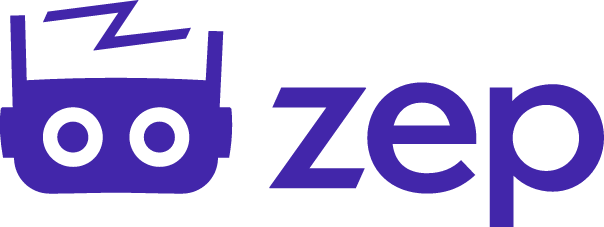
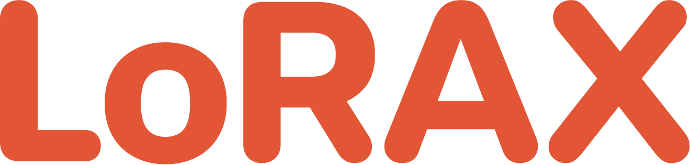
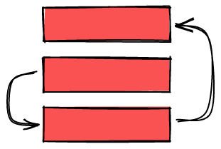
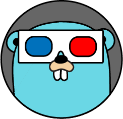
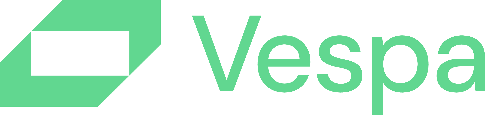
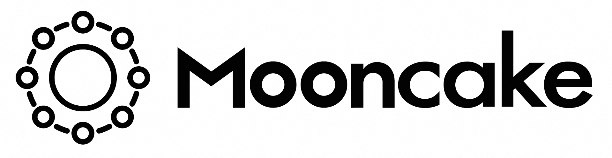
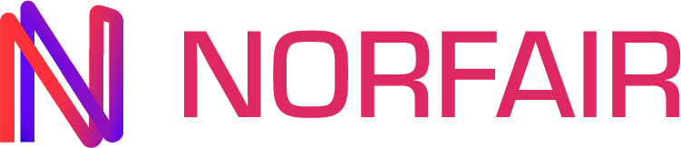
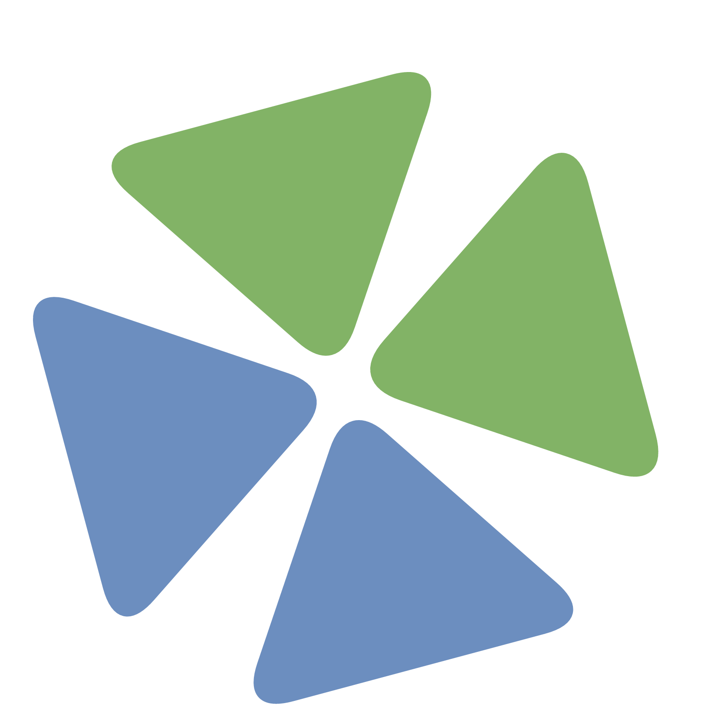

# #100AI Frameworks Lab

<section class="lab-hero">
  

    
Public AI Engineering Lab

    <h1>#100AI Frameworks Lab</h1>
    
I am testing 100 open-source AI frameworks through practical, real project-based experiments and writing engineering notes from the process.

    

      <a href="progress-dashboard/" class="lab-button primary">View dashboard</a>
      <a href="experiments/" class="lab-button">Browse experiments</a>
      <a href="https://www.linkedin.com/in/nijat-zeynalov-064163142/" class="lab-button linkedin-contact" aria-label="Contact on LinkedIn">
        in
        Contact
      </a>
    

  

  <figure class="lab-hero-media">
    
  </figure>
</section>

<section class="metric-grid">
  <article><strong>100</strong>target frameworks</article>
  <article><strong>49</strong>selected</article>
  <article><strong>49</strong>pending</article>
  <article><strong>0</strong>tested</article>
  <article><strong>9</strong>categories</article>
</section>

<section class="logo-marquee-section" aria-label="Framework logos">
  

    

      

      
      
      
      
      
      
      
      
      
      
      
      
      
      
      
      
      
      
      
      
      
      
      
      
      

      

      
      
      
      
      
      
      
      
      
      
      
      
      
      
      
      
      
      
      
      
      
      
      
      
      

    

  

</section>

<section class="lab-section">
  

    
Focus areas

    <h2>Organized by engineering problem, not hype.</h2>
  

  

    <a href="categories/agentic-ai/">Agentic AI & Memory</a>
    <a href="categories/knowledge-base/">Knowledge Base & RAG</a>
    <a href="categories/recsys/">Recommendation Systems</a>
    <a href="categories/lora-finetuning/">LoRA & Fine-tuning</a>
    <a href="categories/computer-vision/">Computer Vision</a>
    <a href="categories/prompt-optimization-eval/">Prompt Optimization & Evaluation</a>
    <a href="categories/model-optimization-compression/">Model Optimization & Compression</a>
    <a href="categories/mlops-model-serving/">MLOps & Model Serving</a>
    <a href="categories/llm-inference/">LLM Inference</a>
  

</section>

<section class="lab-section">
  

    
Workflow

    <h2>Each framework becomes a real project note.</h2>
  

  

    <article>01<h3>Select</h3>
Choose a framework with a clear engineering use case.
</article>
    <article>02<h3>Build</h3>
Use it inside a practical project instead of reviewing it in isolation.
</article>
    <article>03<h3>Document</h3>
Write notes on setup, developer experience, output quality, and tradeoffs.
</article>
    <article>04<h3>Decide</h3>
Summarize where the framework is useful and what I would trust it for.
</article>
  

</section>
